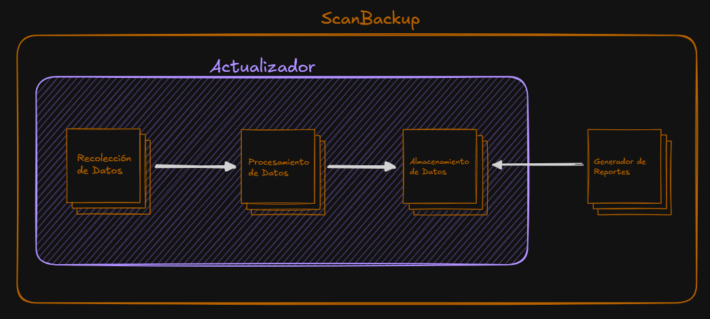

# Scan Backup
Un sistema diseñado para la recolección de datos de tráfico de todas las interfaces de la red a través de la plataforma de Monitoreo (SCAN), y procesamiento de la misma para la generación de distintos reportes para el análisis de tráfico.



# Índice
- [Documentación](#documentación)
- [Requerimientos](#requerimientos)
- [Instalación](#instalación)
- [Pruebas unitarias](#pruebas-unitarias)
- [Comandos Básicos](#comandos-básicos)
    - [Configuración del Sistema](#configuración-del-sistema)
    - [Actualizador del Sistema](#actualizador-del-sistema)
    - [Generador de Reportes](#generador-de-reportes)


# Documentación 
- Para descargar todo el manual técnico, descargue el archivo [Manual Técnico.pdf](./docs/Manual%20Tecnico.pdf).
- Para ver los diagramas, revisa: [Diagramas](https://lucid.app/lucidchart/dad09d4e-e34e-4d32-a254-e62e64d820e4/edit?viewport_loc=-393%2C-398%2C5836%2C3094%2CbOV_OreY9Nsi&invitationId=inv_2ab76b6f-cab5-4df0-bde3-fcae7c263901) o descargue el archivo [Diagramas.pdf](./docs/Diagramas.pdf).

**IMPORTANTE:** Antes de realizar cualquier operación o modificación del sistema, se recomienda leer todo este archivo para entender el funcionamiento del sistema y sus procedimientos.

También puedes visualizar la documentación del funcionamiento en: [Funcionamiento del Sistema](./DOCUMENTATION.md)

# Requerimientos
El sistema requiere la instalación de:
- Python 3.10 o superior. 
- MongoDB 8.0 o superior.

Solo válido para sistemas Linux.

## Variables de Entorno Requeridas
El sistema requiere un archivo `.env.production` o `.env` con las siguientes variables de entorno:
```bash
URI_MONGO="mongodb://localhost:27017/ScanBackupDB"
```
> *Nota*: Para la carga de variables de entorno en modo desarrollador se debe tener el archivo `.env.development` y especificar la opción en los comandos correspondientes (`--dev`).

## Variables en Shell
El sistema requiere que se añadan las siguientes variables a nuestro archivo de shell (`.bashrc` o `.zshrc`):
```bash
export PWDSCANBACKUP="/home/user/ScanBackup" # Debe reemplazarse por la ruta del directorio del sistema
export USERSCAN="usuario" # Debe reemplazarse por el usuario
export PASSWORDSCAN="contraseña" # Debe reemplazarse por la contraseña
```
> *Nota:* Esto es importante para el correcto funcionamiento de la captura de data.

## Otras Variables de Entorno
Solo para el funcionamiento del actualizador de las fuentes de enlaces, se debe añadir las siguientes variables de entorno en el archivo `.env.production` o `.env`:
```bash
SCAN_USERNAME="username"
SCAN_PASSWORD="password"
SCAN_URL_BORDE_HUAWEI="url" # Página principal de los enlaces
SCAN_URL_BORDE_CISCO="url" # Página principal de los enlaces
SCAN_URL_BORDE_JUNIPER="url" # Página principal de los enlaces
SCAN_URL_BRAS_HUAWEI="url" # Página principal de los enlaces
SCAN_URL_CACHING_HUAWEI="url" # Página principal de los enlaces
SCAN_URL_RAI_HUAWEI="url" # Página principal de los enlaces
SCAN_URL_RAI_ZTE="url" # Página principal de los enlaces
SCAN_URL_IPBRAS="url" # Página principal de los enlaces
SCAN_URL_IXP="url" # Página principal de los enlaces
```

> *Nota:* Esto puede ser omitido si no se espera realizar la ejecución del mismo. Por defecto, se puede omitir.

# Instalación 
> *Nota*: Se recomienda realizar la instalación del sistema con el comando disponible del makefile. Revisar [Configuración-del-Sistema](./COMMAND.md#configuración-del-sistema). 

El proyecto cuenta con un archivo `pyproject.toml` que contiene toda la información necesaria para instalar el sistema. 

Para instalar el sistema, se debe ejecutar el siguiente comando:
```bash
pip install .
```

Si se realiza de esta manera, una vez finalizada la instalación de dependencias, debe instancia la base de datos a través del siguiente comando:
```bash
python3 –m scanbackup.database start
```

# Pruebas unitarias
Para ejecutar las pruebas unitarias del sistema, necesario tener el archivo `env.testing` con todas las [Variables de Entorno Requeridas](#variables-de-entorno-requeridas). Los siguientes comandos ejecutan las pruebas pertinentes:
```bash
python3 -m unittest discover -s scanbackup/test/querys -p "*_test.py"
python3 -m unittest discover -s scanbackup/test/updater -p "*_test.py"
python3 -m unittest discover -s scanbackup/test/handler -p "*_test.py"
```

> *Nota:* Tenga en cuenta que siempre puede ejecutar pruebas unitarias individualmente siguiendo la [Documentación oficial de Unittest](!https://docs.python.org/es/3/library/unittest.html) de python.

# Comandos Básicos
## Configuración del Sistema
Para instanciar correctamente el sistema, se debe ejecutar el siguiente comando:
```bash
make setup
```

## Actualizador del Sistema
Para poder ejecutar el actualizador del sistema, se debe ejecutar el siguiente comando:
```bash
make run
```

## Generador de Reportes
> Nota: Se debe tener activado el entorno virtual antes de ejecutar este comando.

Para poder ejecutar el generador de reportes, se debe ejecutar alguno de los siguientes comandos según corresponda:
```bash
python3 -m scanbackup diario
python3 -m scanbackup semanal
python3 -m scanbackup quincenal
python3 -m scanbackup mensual
```

Para más información sobre los comandos disponibles ejecutando el sistema, se puede leer la sección [Comandos](./COMMANDS.md).


